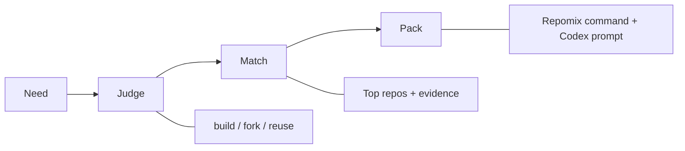

# Repostitch

Choose the right open-source base before you build.

Repostitch is not a GitHub search tool.
It helps builders decide whether to `build`, `fork`, or `reuse`, then generates a Pack for Codex with the smallest context that should matter first.

## How It Works

1. Describe what you want to build in plain language.
2. Repostitch judges `build`, `fork`, or `reuse`.
3. It shows evidence-first repo candidates.
4. It generates a Repomix command and Codex prompt for the winning repo.



## Example Queries

- `I want a self-hosted form builder`
- `I want an open-source helpdesk repo that is good to fork`
- `I want a Codex-friendly admin starter`
- `I want a reusable auth library base`
- `I want a collaborative whiteboard with CRDT syncing`

## Demo Mode

Repostitch includes a lightweight Demo Mode for first-time experience.

- curated showcase queries
- stable local snapshot results
- no live GitHub API dependency
- clearly marked as demo output

Demo Mode is for:

- first-time trial
- recording demos
- showing the product without a GitHub token

Live Mode still uses the GitHub-backed analysis pipeline.
Demo Mode uses a small curated snapshot asset that is intentionally separate from the eval baseline, so the public demo stays lightweight and stable.

## Evaluation And Trust

Repostitch ships with a Golden Query Eval Harness in [`packages/evals`](./packages/evals).

It exists to keep the MVP stable while it evolves:

- repeatable golden queries
- mock and live modes
- query-aware mock retrieval checks
- verdict accuracy checks
- top-k relevance checks
- evidence completeness checks
- pack consistency checks

This is a lightweight product regression harness, not an academic benchmark.
The mock mode is intentionally search-query aware, so retrieval regressions can fail eval instead of silently staying green.

## Why Not Just Use GitHub Search?

GitHub search helps you find repos.

Repostitch is trying to answer a different question first:

- should you build from scratch
- should you fork an existing base
- should you reuse directly

The product is opinionated about workflow:

- `Need`: what are you trying to build
- `Judge`: what kind of starting move is actually credible
- `Match`: which repos support that move
- `Pack`: what Codex should read first

So the goal is not more repo browsing. The goal is a better starting decision.

## Who This Is For

Repostitch is for people who regularly:

- look for open-source bases before starting a product
- fork projects and adapt them
- use Codex or similar tools to work on existing repos
- want a smaller, cleaner handoff than "give the whole repo to the model"

## Current Limits

This project is intentionally constrained.

It does not do:

- deep code understanding
- embeddings
- LLM rerank
- autonomous multi-agent repo modification
- auth
- database-backed sharing
- team workspaces
- private repo support

It currently uses:

- metadata
- lightweight README evidence
- lightweight repo structure evidence
- explainable build / fork / reuse judgment
- structure-aware Pack for Codex

## Stack

- Monorepo
- TypeScript
- pnpm
- Next.js App Router in [`apps/web`](./apps/web)
- Shared schemas in [`packages/core`](./packages/core)
- GitHub integration in [`packages/github`](./packages/github)
- Judge logic in [`packages/judge`](./packages/judge)
- Pack planning in [`packages/pack`](./packages/pack)
- Golden eval harness in [`packages/evals`](./packages/evals)

## Environment

- Node.js 24+
- Git
- pnpm 10.32.1

If `pnpm` is not installed yet:

```bash
corepack enable
corepack prepare pnpm@10.32.1 --activate
```

## GitHub PAT

1. Create a GitHub Personal Access Token.
2. Give it read access to public repositories.
3. Copy the env template:

```bash
cp .env.example .env
```

4. Fill in:

```bash
GITHUB_PAT=ghp_xxx
```

Notes:

- Live Mode expects `GITHUB_PAT` on the server side.
- Demo Mode works without it.

## Cache And Limits

- GitHub search results, repo details, README payloads, and repo structure all use in-memory TTL cache.
- Default TTL is `10` minutes and can be changed with `GITHUB_CACHE_TTL_MS`.
- Cache is process-local only. Restarting the server clears it.
- There is no Redis and no database in this MVP.
- GitHub rate limits can still happen on new queries or after TTL expiry.
- When GitHub rate limits are hit, the API returns structured codes such as `GITHUB_RATE_LIMITED`, and the UI shows a user-readable message.

## How Ranking Works

Ranking is intentionally lightweight and explainable. It does not use embeddings, LLM rerank, or deep code understanding.

The score has three layers:

- `metadata` is the base layer, range `0-80`
  - relevance
  - capability overlap
  - intent fit
  - repo health
  - adoption
  - license fit
- `README` is a bounded boost, range `0-8`
  - deployment clues
  - getting-started clues
  - reuse-shape clues
  - maturity hints
- `structure` is a bounded boost, range `0-8`
  - top-level entry clarity
  - forkability
  - module seams
  - packability

Metadata still leads the ranking. README and structure only strengthen or weaken confidence around the edges.

## README Evidence

Repostitch reads only the repository `README` as extra evidence.

Current extraction looks for lightweight rule-based signals:

- deployment: `docker`, `docker-compose`, `self-hosted`, `deploy`
- getting started: `install`, `setup`, `quickstart`, `usage`
- reuse shape: `starter`, `boilerplate`, `template`, `sdk`, `api`, `library`, `cli`
- maturity hints: screenshots, configuration, `.env`

## Structure-Aware Pack

Pack suggestions look at top-level repo structure and, when helpful, one level of child directories.

Pack scope follows the verdict:

- `build`: reference-first, small context, key entry files only
- `fork`: app surface, config, runtime seams, entry files
- `reuse`: package or module seams, SDK-like folders, public API areas

## Repomix

Install globally:

```bash
npm install -g repomix
```

Or use it on demand:

```bash
npx repomix@latest --help
```

The web app only generates commands. It does not execute Repomix in-browser.

## Evaluation

Run the eval harness with:

```bash
corepack pnpm eval
corepack pnpm eval:update
corepack pnpm eval:live
```

This covers:

- verdict accuracy
- top-k relevance hit
- evidence completeness
- pack consistency with verdict
- structured JSON output for diffing

## Local Run

```bash
corepack pnpm install
corepack pnpm dev
```

Then open [http://localhost:3000](http://localhost:3000).

## Tests And Build

```bash
corepack pnpm typecheck
corepack pnpm test
corepack pnpm build
```

## License

MIT. See [`LICENSE`](./LICENSE).
